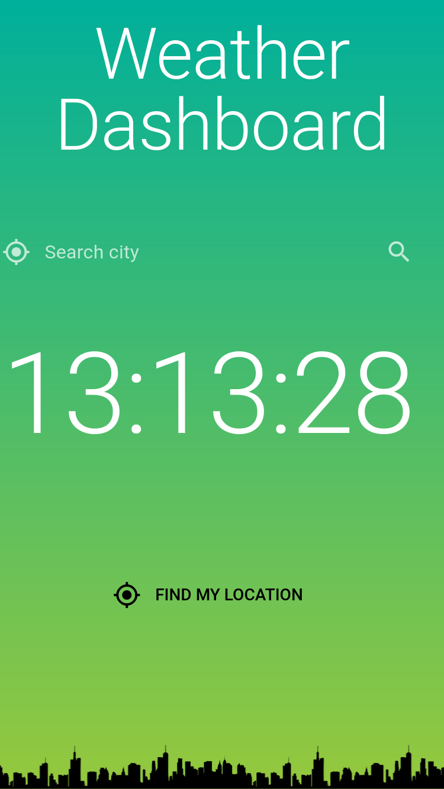
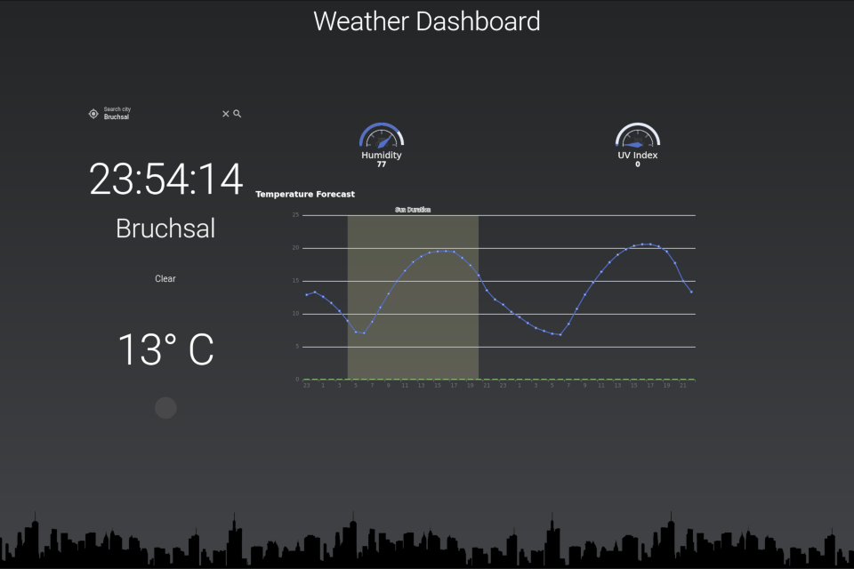
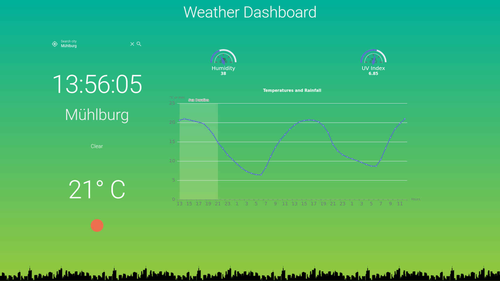

# Dashhome: A Simple OpenWeatherMap Dashboard

A weather dashboard as a kiosk application using the Quasar Framework. There are different types of OpenWeatherMap API. This app supports the current and the One Call API. The API call is trigger every two hours to update the latest weather data.

Start menu of the app as the mobile view mode:



The screenshot after choosing the automatic location finder as the desktop view mode:







## Install the dependencies
```bash
npm install
export PATH=$PWD/node_modules/.bin:$PATH
```

## Getting started

## API Key from OpenWeather

* Signup at openweathermap.org and get an API key. 
* Create a file called `.env` in this project root folder and copy your API key as

```
API_KEY_WEATHER=<api_key>
```

### Start the app in development mode (hot-code reloading, error reporting, etc.)

```bash
quasar dev
```

### Build the app for production

```bash
quasar build
```

### Customize the configuration
See [Configuring quasar.conf.js](https://quasar.dev/quasar-cli/quasar-conf-js).
