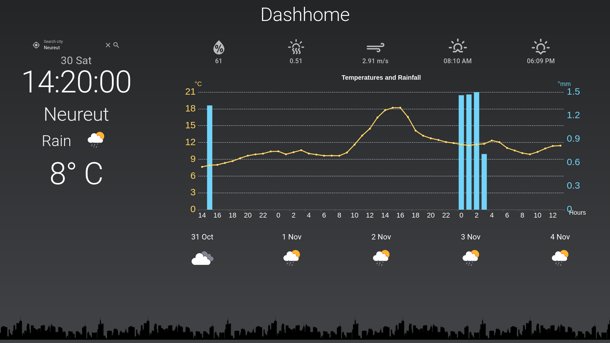

# Dashhome: A Simple OpenWeatherMap Dashboard

A weather dashboard as a kiosk application using the Quasar Framework. There are different types of OpenWeatherMap API. This app supports the current and the One Call API. The API call is trigger every two hours to update the latest weather data.

Start menu of the app as the mobile view mode:


The screenshot after choosing the automatic location finder as the desktop view mode:



The top icons above the chart represent the humidity, UV index, wind speed, sunrise and sunset.

## Install the dependencies
```bash
npm install
export PATH=$PWD/node_modules/.bin:$PATH
```

## Getting started

### Clone to kiosk PC

```
git clone https://github.com/ywiyogo/dashhome.git ~/apps/dashhome
git submodule update --init --recursive
```

### API Key from OpenWeather

* Signup at openweathermap.org and get an API key. 
* Create a file called `.env` in this project root folder, copy your API key and set the update rate in milliseconds.

```
API_KEY_WEATHER=<api_key>
UPDATE_IN_MS=7200000
```

### Start the app in development mode (hot-code reloading, error reporting, etc.)

```bash
quasar dev
```

### Build the app for production

```bash
quasar build
```

### Setup the systemd autostart

1. Create a new service file _~/.config/systemd/user/dashhome.service_ with this content

```
[Unit]
Description=Dashhome

Wants=network.target
After=syslog.target network-online.target
PartOf=graphical-session.target
[Service]
Type=simple
ExecStart=/usr/bin/firefox --kiosk ~/apps/dashhome/dist/spa/index.html &
Restart=on-failure
RestartSec=60
KillMode=process

[Install]
WantedBy=default.target
```

2. Enable service for autostart`systemctl --user enable dashhome && systemctl --user start dashhome`

### Customize the configuration
See [Configuring quasar.conf.js](https://quasar.dev/quasar-cli/quasar-conf-js).
